# 0.4 Nouvelle note (application traditionnelle)

L'utilisateur écrit du texte dans le champ du formulaire de la page `/notes` et clique sur **send**.
Le formulaire a `action='/new_note'` et `method='POST'` : le navigateur effectue donc une soumission
de formulaire classique, sans JavaScript.

```mermaid
sequenceDiagram
    participant browser as Navigateur
    participant server as Serveur (Express)

    Note over browser: L'utilisateur saisit le texte puis clique sur "send"<br/>Déclenchement de l'événement submit

    browser->>server: POST /new_note (Content-Type: application/x-www-form-urlencoded)<br/>corps : note=hello
    activate server
    Note right of server: app.post('/new_note', ...)<br/>lit req.body.note
    server->>server: notes.push({ content: 'hello', date: new Date() })<br/>les notes vivent en mémoire : perdues au redémarrage
    server-->>browser: 302 Found + en-tête Location: /notes
    deactivate server

    Note right of browser: Le navigateur suit automatiquement la redirection

    browser->>server: GET /notes
    activate server
    server-->>browser: Document HTML (structure + <form>, mais PAS la liste des notes)
    deactivate server

    browser->>server: GET /main.css
    activate server
    server-->>browser: la feuille de style
    deactivate server

    browser->>server: GET /main.js
    activate server
    server-->>browser: le script principal
    deactivate server

    Note right of browser: Le navigateur exécute main.js, qui lance<br/>xhttp.open('GET', '/data.json') puis xhttp.send()

    browser->>server: GET /data.json
    activate server
    server-->>browser: [{ "content": "hello", "date": "..." }, ... ] (Content-Type: application/json)
    deactivate server

    Note right of browser: readyState == 4 et status == 200 :<br/>le gestionnaire d'événement onreadystatechange s'exécute<br/>console.log(data) puis création du <ul>/<li> via l'API DOM<br/>et appendChild dans #notes
```

**Total : 5 requêtes HTTP** pour une seule nouvelle note.
Points clés : la logique est dans le serveur, la redirection 302 impose un rechargement complet,
et la modification du DOM par la console du navigateur n'est jamais transmise au serveur.
