# 0.4 Nouvelle note (application traditionnelle)

L'utilisateur écrit du texte dans le champ du formulaire de la page
`https://studies.cs.helsinki.fi/exampleapp/notes` et clique sur **Save**.

Le formulaire est défini ainsi dans le HTML envoyé par le serveur :

```html
<form action='/exampleapp/new_note' method='POST'>
  <input type="text" name="note"><br>
  <input type="submit" value="Save">
</form>
```

Il a donc un `action` et un `method` : le navigateur effectue une soumission de formulaire
classique, sans JavaScript.

```mermaid
sequenceDiagram
    participant browser as Navigateur
    participant server as Serveur (Express)

    Note over browser: L'utilisateur saisit le texte puis clique sur "Save"<br/>Déclenchement de l'événement submit

    browser->>server: POST /exampleapp/new_note<br/>Content-Type: application/x-www-form-urlencoded<br/>corps : note=hello
    activate server
    Note right of server: app.post('/new_note', ...)<br/>lit req.body.note
    server->>server: notes.push({ content: 'hello', date: new Date() })<br/>les notes vivent en mémoire : perdues au redémarrage
    server-->>browser: 302 Found + en-tête Location: /exampleapp/notes
    deactivate server

    Note right of browser: Le navigateur suit automatiquement la redirection

    browser->>server: GET /exampleapp/notes
    activate server
    server-->>browser: Document HTML : structure + <form>, mais PAS la liste des notes
    deactivate server

    browser->>server: GET /exampleapp/main.css
    activate server
    server-->>browser: la feuille de style
    deactivate server

    browser->>server: GET /exampleapp/main.js
    activate server
    server-->>browser: le script principal
    deactivate server

    Note right of browser: Le navigateur exécute main.js, qui appelle<br/>xhttp.open('GET', '/exampleapp/data.json', true) puis xhttp.send()

    browser->>server: GET /exampleapp/data.json
    activate server
    server-->>browser: [{ "content": "hello", "date": "..." }, ...] en JSON
    deactivate server

    Note right of browser: readyState == 4 et status == 200 :<br/>le gestionnaire onreadystatechange s'exécute<br/>console.log(data) puis création du <ul>/<li> via l'API DOM<br/>et appendChild dans #notes
```



**Total : 5 requêtes HTTP** pour une seule nouvelle note.

Points clés :

- Toute la logique est dans le serveur, le navigateur est « stupide ».
- La redirection `302` impose un rechargement complet de la page : 4 requêtes supplémentaires
  (`/notes`, `main.css`, `main.js`, `data.json`).
- Le HTML reçu ne contient pas la liste des notes ; c'est `main.js` qui la construit.
- Les notes sont stockées en mémoire dans le serveur : elles disparaissent au redémarrage.
- Une modification faite depuis la console du navigateur (ajouter un `<li>` au `<ul>`) n'est
  jamais transmise au serveur : elle disparaît au rechargement de la page.
