# 0.5 Application à page unique (chargement de `/exampleapp/spa`)

L'utilisateur ouvre `https://studies.cs.helsinki.fi/exampleapp/spa`.

Le code HTML reçu est le suivant :

```html
<head>
  <link rel="stylesheet" type="text/css" href="/exampleapp/main.css" />
  <script type="text/javascript" src="/exampleapp/spa.js"></script>
</head>
<body>
  <div class='container'>
    <h1>Notes -- single page app</h1>
    <div id='notes'></div>
    <form id='notes_form'>
      <input type="text" name="note"><br>
      <input type="submit" value="Save">
    </form>
  </div>
</body>
```

Deux différences avec la page `/notes` : le formulaire n'a **ni `action` ni `method`**, et c'est
`spa.js` qui est chargé au lieu de `main.js`. Le `<div id='notes'>` est **vide** : la liste des notes
n'est pas dans le HTML.

```mermaid
sequenceDiagram
    participant browser as Navigateur
    participant server as Serveur (Express)

    browser->>server: GET /exampleapp/spa
    activate server
    server-->>browser: Document HTML : coquille vide, <form> sans action/method, <script src="spa.js">
    deactivate server

    browser->>server: GET /exampleapp/main.css
    activate server
    server-->>browser: la feuille de style
    deactivate server

    browser->>server: GET /exampleapp/spa.js
    activate server
    server-->>browser: le script de la version SPA
    deactivate server

    Note right of browser: Le script s'exécute immédiatement :<br/>xhttp.open('GET', '/exampleapp/data.json', true)<br/>puis xhttp.send() — avant même window.onload

    browser->>server: GET /exampleapp/data.json
    activate server
    server-->>browser: [{ "content": "HTML is easy", "date": "..." }, ...] en JSON
    deactivate server

    Note right of browser: readyState == 4 et status == 200 :<br/>notes = JSON.parse(...)<br/>puis redrawNotes() qui crée le <ul> et les <li> via le DOM

    Note right of browser: window.onload enregistre ensuite le gestionnaire :<br/>form.onsubmit = function (e) { ... }
```



**Total : 4 requêtes HTTP.** Aucune navigation, aucune redirection.

Le point essentiel : le HTML envoyé par le serveur ne contient **que la structure** de la page.
C'est le JavaScript exécuté dans le navigateur qui fabrique le HTML de la liste des notes.
C'est ce qui distingue une application monopage d'une application web traditionnelle.
