# 0.5 Application à page unique (chargement de `/spa`)

L'utilisateur ouvre `https://studies.cs.helsinki.fi/exampleapp/spa`.
Le code HTML est presque identique à celui de l'application traditionnelle, mais le formulaire
n'a **ni `action` ni `method`**, et le script chargé est `spa.js`.

```mermaid
sequenceDiagram
    participant browser as Navigateur
    participant server as Serveur (Express)

    browser->>server: GET /spa
    activate server
    server-->>browser: Document HTML + <form> sans action/method + <script src="spa.js">
    deactivate server

    browser->>server: GET /main.css
    activate server
    server-->>browser: la feuille de style
    deactivate server

    browser->>server: GET /spa.js
    activate server
    server-->>browser: le script de la version SPA
    deactivate server

    Note right of browser: Le navigateur exécute spa.js, qui appelle<br/>redrawNotes() puis xhttp.open('GET', '/data.json') / send()<br/>pour récupérer les notes existantes

    browser->>server: GET /data.json
    activate server
    server-->>browser: [{ "content": "HTML is easy", "date": "..." }, ... ] en JSON
    deactivate server

    Note right of browser: readyState == 4 et status == 200 :<br/>JSON.parse + console.log + création des <li> dans le <ul> via le DOM
```

**Total : 4 requêtes HTTP.** Aucune navigation, aucune redirection.
Le HTML envoyé ne contient qu'une coquille : c'est le JavaScript exécuté dans le navigateur
qui fabrique le HTML de la liste des notes.
