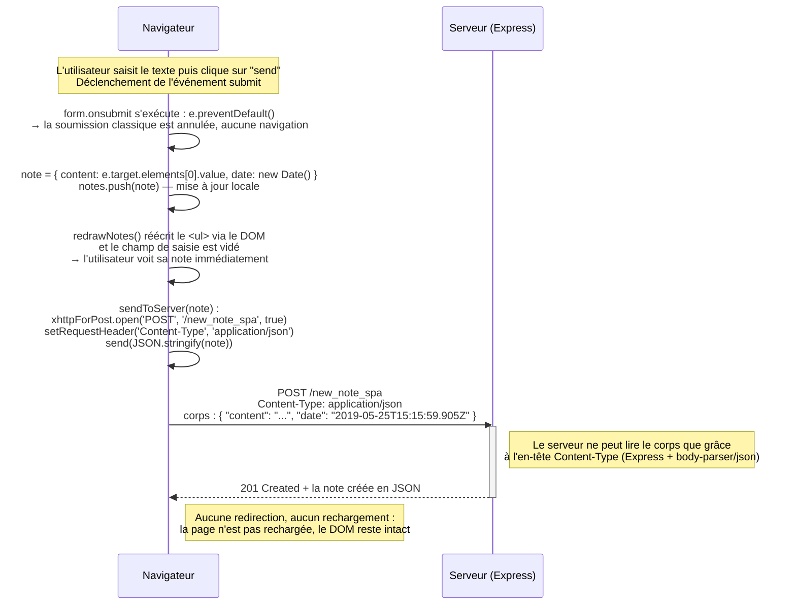

# 0.6 Nouvelle note dans la version SPA

L'utilisateur écrit une note dans le formulaire de `/spa` et clique sur **send**.
Le formulaire n'ayant pas d'attribut `action`, c'est le gestionnaire d'événement `onsubmit`
de `spa.js` qui prend la main.

**Total : 1 seule requête HTTP.** C'est toute la différence avec l'exercice 0.4 :
la note apparaît à l'écran *avant* d'être confirmée par le serveur, et le serveur répond `201`
au lieu d'une redirection `302`.
