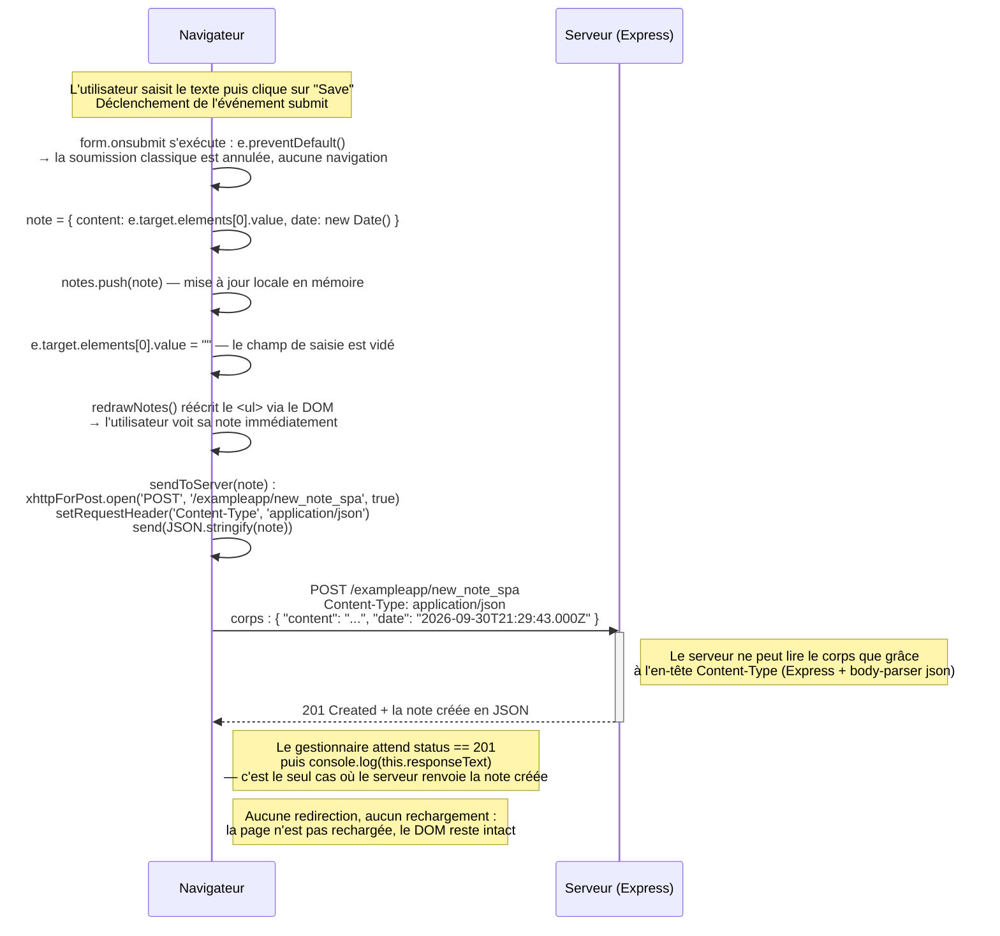

# 0.6 Nouvelle note dans la version SPA

L'utilisateur écrit une note dans le formulaire de `/exampleapp/spa` et clique sur **Save**.
Le formulaire n'ayant pas d'attribut `action`, c'est le gestionnaire `form.onsubmit` enregistré
par `window.onload` dans `spa.js` qui prend le relais.

**Total : 1 seule requête HTTP.** C'est toute la différence avec l'exercice 0.4 :

| | Application traditionnelle (0.4) | Application monopage (0.6) |
| --- | --- | --- |
| Requêtes | 5 | 1 |
| Envoi des données | soumission de formulaire, `application/x-www-form-urlencoded` | JavaScript, `application/json` |
| Réponse du serveur | `302 Found` + redirection | `201 Created`, pas de redirection |
| Rendu de la nouvelle note | après rechargement complet de la page | immédiatement, avant la confirmation du serveur |

La note apparaît à l'écran **avant** d'être confirmée par le serveur : c'est le comportement
d'une application monopage.
